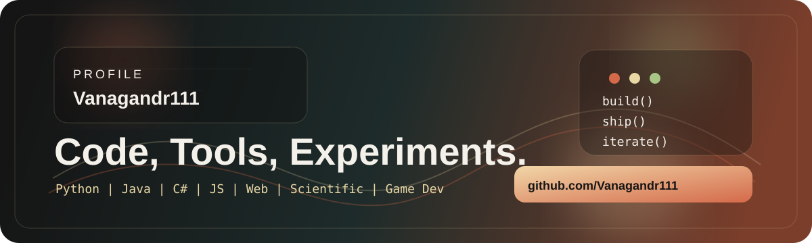

# 

<p align="center">
  
</p>

<p align="center">
  <a href="https://github.com/Vanagandr111?tab=repositories">
    
  </a>
  <a href="https://github.com/Vanagandr111">
    
  </a>
  <a href="https://github.com/Vanagandr111?tab=projects">
    
  </a>
</p>

## About

I build practical software: data tools, automation, backend services, and small experiments that eventually grow into products.

I also work with AI-oriented pipelines: prompt design, model behavior shaping, fine-tuning workflows, and systems built around interactive character logic.

Right now the center of gravity is:

- Python for utilities, bots, processing pipelines, and applied tooling
- Java for coursework, backend fundamentals, and service-oriented exercises
- C# for desktop applications, internal tools, and business logic
- JavaScript plus HTML/CSS for web interfaces and frontend work
- Scientific software and data-oriented development
- Game development experiments and engine-side prototyping
- AI workflows, model adaptation, and fine-tuning

## Selected Work

| Project | What it does | Stack |
| --- | --- | --- |
| [endoscope](https://github.com/Vanagandr111/endoscope) | Python project in active development | Python |
| [DataFusion-RT](https://github.com/Vanagandr111/DataFusion-RT) | Data-oriented runtime tooling and experiments | Python |
| [video-transcriber](https://github.com/Vanagandr111/video-transcriber) | Audio and video transcription workflow | Python |
| [OrtusCapture](https://github.com/Vanagandr111/OrtusCapture) | Java project from the current public portfolio | Java |
| [ImgPIn](https://github.com/Vanagandr111/ImgPIn) | Imaging-focused utility work | Python |

## What I Like Building

```text
automation scripts
developer tooling
CLI workflows
data processing
backend exercises
scientific software
game development
web interfaces
AI systems
fine-tuning workflows
small systems with clear behavior
```

## GitHub Snapshot

<p align="center">
  
  
</p>

## Credentials and Education

| Credential | Organization | Details |
| --- | --- | --- |
| C# Competency Certificate | National IT Competency Assessment System, Ministry of Digital Development | Confirmed on `03.07.2025`, unique ID `218303`, C# theory and practice, base level |
| Java Developer Program | Netology LLC | Series and number `PP 15155`, issue date `03.07.2023`, registration number `12995`, specialization: `Java Developer` |
| Web and Multimedia Applications Developer | Kemerovo State University | Series and number `4310 0385756`, issue date `14.07.2023`, registration number `562-k`, specialization: `Web and Multimedia Applications Developer` |

## Current Direction

- Turning old coursework into a cleaner archive instead of profile noise
- Keeping the account focused on stronger public projects
- Growing a portfolio around useful software rather than random dumps
- Expanding into scientific software, web development, and game dev
- Pushing deeper into AI systems, behavior tuning, and model-driven interactions

## Current Private Work

Right now I am working hard on a private AI project: training and shaping my own model for roleplay-focused game interactions, where the AI acts as an NPC-style system with stronger character behavior, better dialogue consistency, and more immersive response flow.

## Profile Notes

- Private coursework is cleaned up and separated from the main public portfolio
- Public repositories are the curated part of the profile
- More polished projects will replace legacy experiments over time
- Core stack includes Python, Java, C#, JavaScript, HTML, and CSS
- I actively explore AI, fine-tuning, interactive systems, and game-oriented character logic
